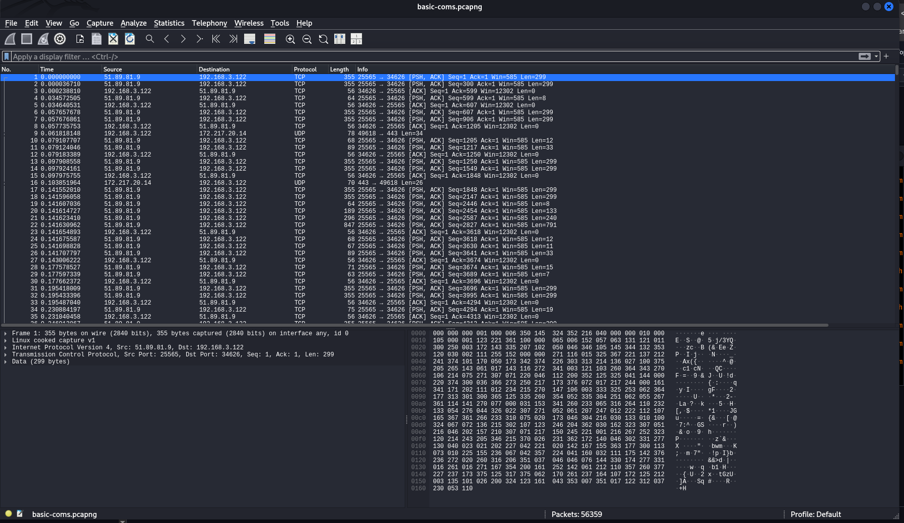
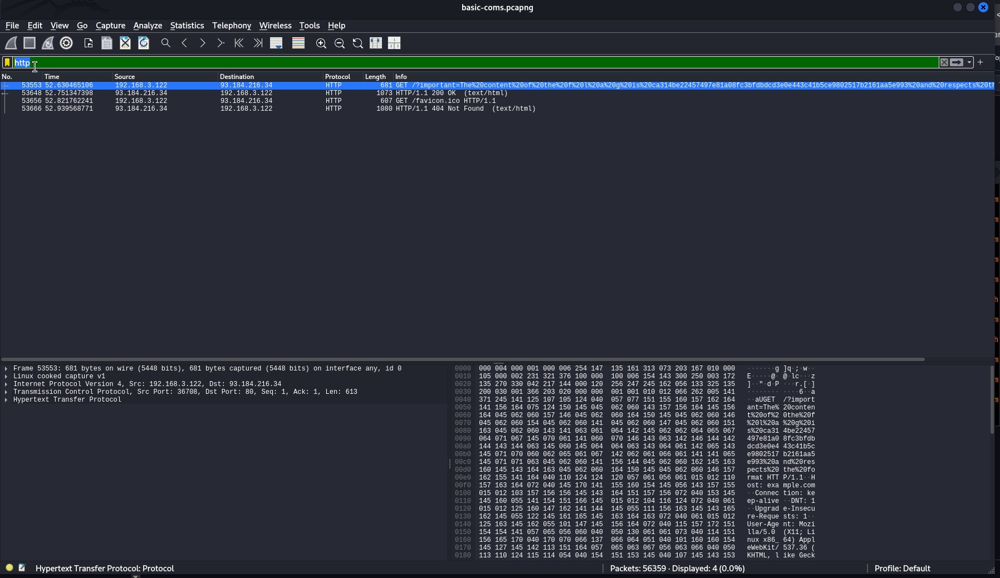
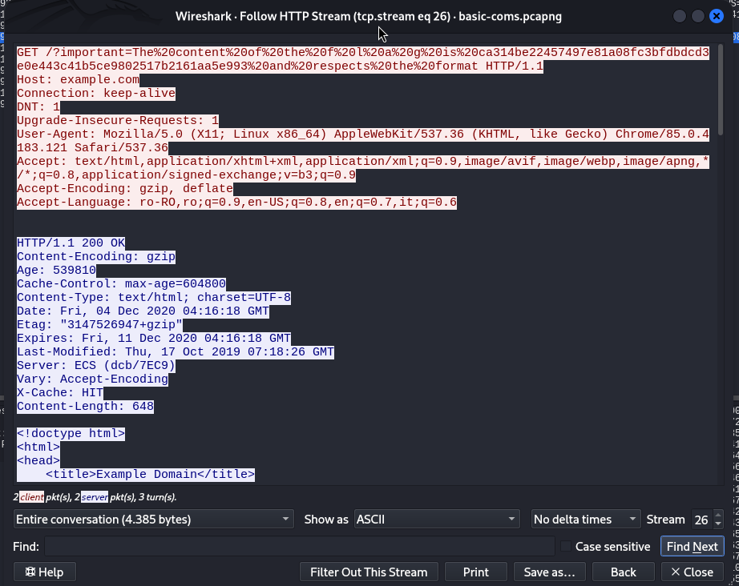
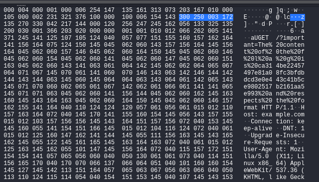

Enuntul ne spune **Cauta si vei gasi steagul**, pai atunci hai sa-l cautam

Rezolvare:

1. prima data sa descarcam acel fisier si sa vizualizam prin comanda:

                                   xdg-open basic-coms.pcapng
   
   Observam ca ne trimite direct prin **wireshark** si ar trebui sa ne uitam prin acele pachete multe

2. inainte de a vizualiza prin pachete, am folosit comanda:

                                     strings basic-coms.pcapng| grep CTF

   Si a afisat:

                                      &B.CTF
                                      sCTF1u
                                      ~CTF2

  Nimic folositor de aici, am testat cu gandul ca poate aici se ascunde flag-ul dar m-am inselat,
  ne scufudam mai departe, si am folosit comanda:
  
                                     file basic-coms.pcapng
  
  Si a raspuns la asta: 
 
                                     basic-coms.pcapng: pcapng capture file - version 1.0

  Obsevram ca e versiune de 1.0, veche

  Dar si cu comanda:

                                      exiftool basic-coms.pcapng

  Dar si acolo sunt niste informati la fisier si nici gand un flag sau alt ceva ascuns.
  Asa ca am decis sa analizez acel pachet prin *wireshark*

                                       wireshark basic-coms.pcapng

  Vedem acolo ca ne-a afisat multe pachete, asa cum se observa imaginea de mai jos:

4. Sa putem gasi flag-ul, ne ducem la bara de cautare si scriem:

                                            http

  Si ne afiseaza doar cateva pachete care trasmit de http, care s-au capturat, si sus la optiunea de *Analyze* pe optiunea
  de *Fallow* la HTTP STREAM, vedem ca e un link, mai bine zis un site dar cu numele de flag gasit, cum e in imaginea 
  de jos:

  
  Asta e flag-ul:  GET /?important=The%20content%20of%20the%20f%20l%20a%20g%20is%20ca314be22457497e81a08fc3bfdbdcd3e0e443c41b5ce9802517b2161aa5e993%20and%20respects%20the%20format HTTP/1.1

   Adica:
                                   ca314be2247497e81a08fc3bfdbdcd3e0e443c41b5ce9802517b2161aa5e993
                                       

---
!!!SUGESTII!!

Chiar daca nu gaseati la STREAM, puteati sa vizionati si la Hex cum e in imagine:

Sau pe partea cealalta cum e aici:

---

Flag gasit !!!
 
FLAG: CTF{ca314be2247497e81a08fc3bfdbdcd3e0e443c41b5ce9802517b2161aa5e993}

---
Poate va intrebati de ce vedeti asta la link-ul de mai sus:
 
                             %20 ---> asta se considera ca fiind un spatiu la cuvinte

---

SUCCES :)))

